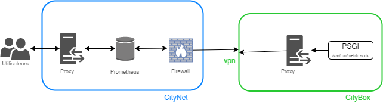
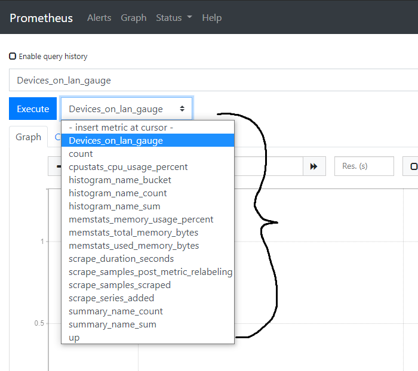

## Overview

_**SERVEUR** = Serveur REST implémenté avec un psgi._

### Objectif 
Regrouper tous les métriques collectés en une seule interface et la possibilité de faire des opérations entre chaque métrique.

### Documentation officiel 
* .
* .
*  *(module perl utilisé pour la collecte des données)*.
* .

### Schéma de l'architecture générale


### Quelques définitions
 *  : 
 Prometheus collecte des données sous forme de séries temporelles. Les séries temporelles sont récupérées de manière active : le serveur Prometheus interroge une liste de sources de données (les exporteurs)
à une fréquence d'interrogation spécifique. Ces points de collecte servent de sources de données à Prometheus. Prometheus dispose d'une API web permettant de visualiser les données collectées.

 *  : 
 Prometheus dispose de son propre langage de requête PromQL (Prometheus Query Language) Ce langage permet aux utilisateurs de sélectionner et d'agréger les métriques stockées en base de données.
Il est particulièrement adapté aux fonctionnements avec une base de données de séries temporelles fournissant de nombreuses fonctionnalités spécifiques à la manipulation du temps (décalage de temps, calcul de moyenne, maximum etc.).
Prometheus supporte quatre types de métriques : 
    *  (température absolue, quantité d'espace disque consommé).
    *  (nombre de requêtes depuis le lancement d'un programme).
    *  (échantillonnage d'un nombre de requête dans plusieurs containers afin de calculer des ).
    *  (relativement similaire à la notion d'histogramme avec des notions supplémentaires).

 * Collecteur : 
 Les collecteurs sont dans notre cas des modules perl. Chacun de ces modules dispose d'une méthode "Create()" et "Collect()". "Create()" retourne un hashmap bénie par le collecteur (.pm). 
"Collect()"  collecte les données et retourne un "". 
Afin de collecter des données il faut que le collecteur soit "créer" ( "Create()" ) et d'être  au sein du **SERVEUR**.
 
### Packages nécessaire
* Côté Citybox : 
    * p5-Net-Prometheus
        * p5-Struct-Dumb
        * p5-Ref-Util
    * p5-OpenBSD-KvmFiles (nécessaire pour le collecteur `kvm_files_collector.pm`)
    
* Côté Citynet :
    * Prometheus
    * Mustache::Simple
    * VictoriaMetrics
    * Rsync

### Description générale du fonctionnement côté Citybox
* Les boîtiers sont pourvu d'un **SERVEUR** (/cloudgate/metrics.psgi) qui écoute sur une socket UNIX.
* Le **SERVEUR** est pourvu de plusieurs collecteurs (les collecteurs se trouvent la: /cloudgate/lib/<nom_du_collecteur>.pm).
* Le **SERVEUR** accepte un argument au lancement "SCRAPE_INTERVAL" cette valeur permet de définir l'intervalle de GET de prometheus, en cas d'absence de Prometheus un service Sauron va  un collecteur ( /cloudgate/lib/data_saved_collector.pm  ) qui va récupérer à intervalle de temps régulier les données des collecteurs enregistrés
dans le collecter les données à la place de Prometheus. Une fois que Prometheus est de retour le collecteur va donner les données collectés à Prometheus puis le collecteur va se .
* Le **SERVEUR** met à disposition plusieurs endpoints HTTP pour interagir avec lui, voici une liste de tous les endpoints avec un courte description de ces-derniers:
    *  /prom/metrics : 
        * Endpoint n'acceptant que le User-Agent de Prometheus ("Prometheus/0.00.0") et les méthodes GET.
        * Rôle : Exposer les données à Prometheus.
        * Lorsque le psgi reçoit une requête valide sur cette endpoint le psgi va appeler la fonction  de chacun des collecteurs (collecte des données) pour retourner les données collectées sous le format d'.
        * L'instant pour une requête valide est pris en compte est stocké dans une variable.
    * /complex/insert/<metric_name>/<instance>/<value> :
        * Endpoint n'acceptant que le User-Agent metrics_pusher et les méthodes POST.
        * Rôle : Permettre à l'existant de pousser des données dans Prometheus de manière simple.
    * /simple/insert/<metric_name>/<value> : 
        * Endpoint n'acceptant que le User-Agent "metrics_pusher" et les méthodes POST.
        * Rôle : Permettre à l'existant de pousser des données dans Prometheus de manière simple.
    * /prom/deamon/metrics : 
        * Endpoint n'acceptant que le User-Agent de Prometheus ("Prometheus/0.00.0") et les méthodes GET.
        * Rôle : Exposer les métriques qui ont été poussées par des démons en utilisant le format d'.
    * /prom/status : 
        * Endpoint n'acceptant que le User-Agent "checker" et les méthodes GET.
        * Permet de connaître le statut du psgi.
    * /last/get/prometheus : 
        * Endpoint n'acceptant que le User-Agent "checker" et les méthodes GET.  
        * Rôle : Informer le service sauron l'état des collectes de Prometheus.
        * Permet de connaître le temps écoulé depuis le dernier GET de Prometheus.
       
_Une courte documentation est présente dans les premières lignes du fichier  /cloudgate/metrics.psgi, il y a des exemples de CURL pour tester / debugger._


### Description du fonctionnement coté Citynet
* Chaque groupe possède un serveur Prometheus.
* Étant donnée que la compression de Prometheus n'est pas optimale, une base de données VictoriaMetrics est présente. Prometheus va pousser les données dans Victoria Metrics.
* Rétention Prometheus : ~ quelques jours/semaines.
* Rétention Victoria Metrics: ~ quelques années.
* Des services sauron permettent de gérer les bases de données.
_Une spécification technique est disponible sur  si tu souhaites avoir plus de détails._

### Description de "Baggage"

Le but de "Baggage" est d'avoir une interface qui centralise l'affichage des données. 


## Ajout de collecteur

### Ajout d'un collecteur "classique"
#### Étapes
Cette partie décrit les étapes à suivre dans le but de réaliser pour créer un collecteur simple.
1. Création du collecteur.pm
    1. Il vous faut créer une première fonction Create() (comme décrit précédemment) 
Exemple pour un collecteur s'appellant exemple_collector.pm :
    ```pl
    sub Create {
      return bless {}, ' exemple_collector  ';
    }
    ```
    1. Créer une fonction collect() cette fonction doit collecter les donner et les retourner dans un  Voici un exemple :
    ```pl
    sub collect {
       my $class = shift @_;
      my $time = ceil( Time::HiRes::time() * 1000 );
      open my $psprog, '-|', '/bin/ps', '-A', '-o', 'pid,pcpu'
        or  $cloudgate::logger->error('can open ps :', $!);
      my $total = 0;
      while (my $line = <$psprog>) {
        unless ( $line =~ /[\d]+\s+(?<cpu>\d+\.\d+)/ ) {
          $cloudgate::logger->debug('Ignoring line from ps :', $line);
          next;
        }
        $total += $+{cpu};
      }
      close $psprog;
      my @a = ( Sample( 'cpustats_cpu_usage_percent', [], "$total $time") );
      my @ret = (
        MetricSamples( 'Cpu_informations', 'gauge', 'Contains CPU usage in %', \@a )
      );
      return @ret;
    }
    ```
1. A présent il vous faut ajouter le collecteur à la liste des collecteurs présent dans /cloudgate/metrics.psgi
Exemple pour un collecteur s'appellant exemple_collector.pm :
  ```pl
  my @collectors = (
    'ram_collector'
    ,'cpu_collector'
    ,'kvm_files_collector'
    ,'count_devices_on_lan'
    ,'net_interface_io'
    ,'exemple_collector' # ici
  );
  ```
#### Vérifications
* (sur la machine possédant le **SERVEUR**) :
`curl -m 2 --user-agent 'Prometheus/2.13.1' --unix-socket /var/www/run/metrics.sock http://base/prom/metrics`
curl -m 2 --user-agent 'Prometheus/2.13.1' --unix-socket /var/www/run/metrics.sock http://base/prom/metrics
Vous devriez y voir le métrique que vous avez ajouté.

* Curl à Prometheus : 
`curl -m 2 <adresse_prometheus>/api/v1/label/__name__/values`
Cette requête retourne le nom de tous les métriques présent sur la base de donnée Prometheus.
_( N'oubliez d'attendre que Prometheus ai ingérer les métriques après votre ajout récent )_.

* Sur l'interface de Prometheus :




### Ajout d'un collecteur à fréquence de collecte prédéfinie

Afin de créer un collecteur qui collecte des données à une fréquence différente que celle de Prometheus il vous faut reproduire l'étape 1 présent la partie **Ajout d'un collecteur "classique"**. Une fois que vous avez un *collecteur.pm* suivez les étapes ci-dessous:

#### Étapes
1. Rendez-vous dans le fichier `/cloudgate/metrics.psgi` 
1. Ajoutez le nom de votre collecteur dans la liste des collecteurs chronométré de la manière suivante (_pour un collecteur ayant comme intervale 10 minutes et comme nom `example_collector.pm`_):
```pl
my %timed_collector;
# Collect every 5 min = 300 s
$timed_collector{'300'} = {
  'collectors'=>['cpu_temperature_collector'],
  'last_collection'=> $last_get_from_Prometheus
};
# Collect every 10 min = 600 s
$timed_collector{'600'} = { # <= ici l'intervalle de temps entre chaque collecte
  'collectors'=>['example_collector'], # <= ici le nom du collecteur
  'last_collection'=> $last_get_from_Prometheus
};
```
Si vous souhaitez ajouter un collecteur dans ayant comme intervalle de collecte ajoutez le dans la liste voir exemple ci-dessous (_pour un collecteur s'appellant `example_collector2.pm`_):
```pl
$timed_collector{'600'} = { # <= ici l'intervalle de temps entre chaque collecte
  'collectors'=>['example_collector','example_collector2'], # <= ici le nom du collecteur
  'last_collection'=> $last_get_from_Prometheus
};
```
#### Vérifications

* Curl à Prometheus : 
`curl -m 2 <adresse_prometheus>/api/v1/label/__name__/values`
Cette requête retourne le nom de tous les métriques présent sur la base de donnée Prometheus.
_( N'oubliez d'attendre que Prometheus ai ingérer les métriques après votre ajout récent )_.

* Sur l'interface de Prometheus :


## Ajout de métrique via Baggage
### Configuration de nouveau métrique simple (sans promQL)

En cas d'ajout de collecteur il est préférable d'ajouter ce métrique dans les fichiers de configuration de Baggage.
Voici les étapes à suivre :
1. Dans le fichier JSON suivant `/src/assets/json/metric_name_for_human.json` il y a plusieurs propriété chacune d'entre elles désigne un rôle (Admin, Support, User, ...).
Ajoutez aux rôles souhaitez ( rôles qui peuvent visualiser les données ) la propriété suivante :
  ```JSON
  {
    "<role>":{
      "<nom_du_metrique>":{
        "en":"<traduction anglaise>",
        "fr":"<traduction française>"
      }
    }
  }
  ```
  ```
  <nom_du_metrique> = Nom du métrique présent dans prometheus.
  <traduction anglaise> = Nom affiché en version anglaise.
  <traduction française> = Nom affiché en version française.
  ```
  1. Dans le fichier JSON suivant `/src/assets/json/config.metrics.json` ajoutez une propriété correspondant au nom du métrique (nom présent dans prometheus) un exemple est présent dans le fichier.
  
#### Exemple de résultat :
  
  
### Configuration de nouveau métrique (avec promQL simple)
Attention la démarche à suivre ne fonctionnera que si la requête promQL est de cette forme : `<query>(<metric_name>)`.

Il est recommandé de tester les requêtes  via l' avant.

Par exemple : 
* deriv(output[5min])  ➔   OK
* sum(output)  ➔   OK
* sum(Devices_on_lan_gauge{LanId=~"Lan_1| Lan_2| "})  ➔   NOK 

Voici les étapes à suivre :
1. Reproduire toutes les étapes présent dans la partie précédente (_"Configuration de nouveau métrique simple (sans promQL)"_)
1. Rendez-vous dans le fichier JSON suivant : `/src/assets/json/config.metrics.json`
1. Dans la propriété "promql" ajouté la fonction que vous souhaitez appliquer
1. Dans la propriété "type" précisez quel type de vecteur l'opération à besoin ()
1. Si vous souhaitez garder le métriques sans la fonction promQL il vous faut ajouter un métrique comme dans la partie au dessus en ajoutant "\_raw" à la fin du nom.

Exemple pour un métrique `input` ayant comme promql `deriv(input)` :
`/src/assets/json/metric_name_for_human.json` :
```JSON
{
  "input_raw":{
    "en":"input raw",
    "fr":"input raw"
  },
  "input":{
    "en":"input",
    "fr":"input"
  }
}
```

`/src/assets/json/config.metrics.json` :
```JSON
"input": {
    "x": {
      "unit": {
        "fr":"o/s",
        "en":"B/s"
      }
    },
    "y": {
      "min": 0,
      "step": ""
    },
    "type": "range_vectors",
    "promql": "deriv",
    "tension": 0.5
  },
"input_raw": {
    "x": {
      "unit": {
        "fr":"o",
        "en":"B"
      }
    },
    "y": {
      "min": 0
    },
    "type": "",
    "promql": "",
    "tension": 0.5
  },
```
#### Exemple de résultat :


### Configuration d'un nouveau métrique (avec promQL complexe)

1. Rendez-vous dans le fichier JSON suivant : `/src/assets/json/config.metrics.json`.
1. Ajoutez un propriété portant le nom du métrique que vous souhaitez ajouter dans :

```JSON
"custom_metric":{
    "instant_vectors":{
     }
}
```

```JSON
"custom_metric":{
    "range_vectors":{
     }
}
```

```JSON
"custom_metric":{
  "instant_vectors":{
    "LAN_1_3":{
      "role": ["Support", "Admin"],
      "query":"sum(Devices_on_lan_gauge{lan_id=~\"LAN_1|LAN_3\"}<box_filter>)",
      "description":"Lan1 + Lan3"
    }
  }
}
```

1. Ensuite reproduisez les étapes présent dans la partie  "_Configuration de nouveau métrique simple (sans promQL)_" en utilisant le nom de la propriété que vous avez utilisé précédement.

#### Exemple de résultat :

